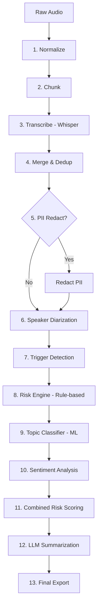

# CallIntel: Project Overview & Pipeline Documentation

## 1. Project Overview
CallIntel is a robust, modular pipeline designed for the automated analysis of Arabic and English call recordings. It transforms raw audio into a structured intelligence report by performing transcription, sentiment analysis, risk assessment, topic classification, and PII redaction.

## 2. System Architecture
The system follows a modular stage-based architecture. Each stage is independent, testable, and produces intermediate artifacts in a temporary workspace before final export.

### The Pipeline Process


---

## 3. Pipeline Stages Explained

| Stage | Module | Description |
|---|---|---|
| **Normalize** | `utils_audio.py` | Converts audio to 16 kHz mono WAV for model compatibility and consistent volume. |
| **Chunk** | `utils_audio.py` | Splits long audio into 30 second chunks with 2 second overlap to optimize GPU memory during transcription. |
| **Transcribe** | `transcribe.py` | Uses Whisper Large v3 to convert audio chunks into text segments with timestamps. |
| **Merge** | `merge.py` | Stitches chunks back together using a suffix-prefix overlap deduplication algorithm. |
| **PII Redact** | `pii_redact.py` | Optionally masks sensitive data like Egyptian IDs, credit cards, and phone numbers. |
| **Diarization** | `diarize.py` | Uses Pyannote 3.1 to identify speakers and align them with the transcript. |
| **Triggers** | `triggers.py` | Scans for trigger keywords defined in `config.py`. |
| **Risk Engine** | `risk_engine.py` | Rule-based scoring using a multi-category dataset and Arabic normalization. |
| **Classifier** | `classifier.py` | Uses MARBERTv2 to categorize the call and detect content-based risk. |
| **Sentiment** | `sentiment.py` | Analyzes Arabic sentiment using CAMeLBERT. |
| **Combined Risk** | `pipeline.py` | Merges scores from rules, ML, and sentiment and adds a position bonus for late-call risk. |
| **LLM Eval** | `evaluate_llm.py` | Generates a concise summary using a local LLM or a heuristic fallback. |

---

## 4. Models Used

1. **Whisper (Large-v3)**: multilingual ASR for transcription.
2. **CAMeLBERT Sentiment**: Arabic sentiment model.
3. **MARBERTv2**: Arabic dialect and MSA classifier.
4. **Pyannote 3.1**: speaker diarization pipeline.

---

## 5. Output Documentation
When a call is processed, a folder is created in `data/output/` named after the audio filename.

### Directory Structure
```text
output/test_call.mp3/
|-- Transcript/
|   |-- transcript.txt
|   `-- transcript.json
`-- LLM_Justification/
    |-- combined_risk.txt
    |-- combined_risk.json
    |-- sentiment.json
    |-- diarization.json
    |-- pii_redaction.json
    |-- risk_detail.json
    |-- classifier_detail.json
    |-- llm_report.txt
    |-- llm_report.json
    `-- score.json
```

---

## 6. Quick Setup On A New Machine

Minimal runtime setup:

```bash
python -m venv .venv
.\.venv\Scripts\Activate.ps1
python scripts/setup.py
```

That installs the Python dependencies, creates `.env` if needed, and downloads the required Whisper model to `models/whisper-large-v3`.

Optional full setup:

```bash
python scripts/setup.py --all
```

This also downloads the sentiment model and installs diarization support. Diarization requires `HF_TOKEN` in `.env`.

---

## 7. How To Configure
The system uses environment variables loaded from `.env`:

- `LANGUAGE`: default language for trigger detection (`ar` or `en`)
- `TRIGGER_TERMS`: comma-separated list of words to watch for
- `WHISPER_MODEL_PATH`: location of the local Whisper weights
- `SENTIMENT_MODEL_PATH`: location of the local sentiment model
- `CLASSIFIER_MODEL_PATH`: location of the optional classifier model
- `HF_TOKEN`: Hugging Face token required for diarization

## 8. Quality Assurance
The project includes **111 unit tests** in the `tests/` directory covering every module. Run them with:

`python -m pytest tests/`
