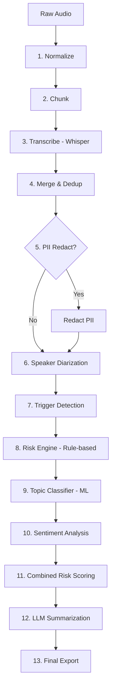

# CallIntel: Project Overview & Pipeline Documentation

## 1. Project Overview
CallIntel is a robust, modular pipeline designed for the automated analysis of Arabic (and English) call recordings. It transforms raw audio into a structured intelligence report by performing transcription, sentiment analysis, risk assessment, topic classification, and PII redaction.

## 2. System Architecture
The system follows a **Modular Stage-Based Architecture**. Each stage is independent, testable, and produces intermediate artifacts in a temporary workspace before final export.

### The Pipeline Process


---

## 3. Pipeline Stages Explained

| Stage | Module | Description |
|---|---|---|
| **Normalize** | `utils_audio.py` | Converts audio to 16kHz mono WAV for model compatibility and consistent volume. |
| **Chunk** | `utils_audio.py` | Splits long audio into 30s chunks (with 2s overlap) to optimize GPU memory during transcription. |
| **Transcribe** | `transcribe.py` | Uses OpenAI Whisper (Large-v3) to convert audio chunks into text segments with timestamps. |
| **Merge** | `merge.py` | Stitches chunks back together using a suffix-prefix overlap deduplication algorithm. |
| **PII Redact** | `pii_redact.py` | (Optional) Masks sensitive data like Egyptian IDs, Credit Cards, and Phone numbers. |
| **Diarization** | `diarize.py` | Uses Pyannote 3.1 to identify speakers (SPEAKER_00, etc.) and align them with the text. |
| **Triggers** | `triggers.py` | Scans for specific keywords (Manager, Order, Refund, etc.) defined in `config.py`. |
| **Risk Engine** | `risk_engine.py` | Rule-based scoring using a multi-category dataset (`data/bad_words.json`). Handle Arabic normalization. |
| **Classifier** | `classifier.py` | Uses MARBERTv2 to categorize the call (Sales, Support, Complaint, etc.) and detect content-based risk. |
| **Sentiment** | `sentiment.py` | Analyzes Arabic sentiment (Negative/Neutral/Positive) using CAMeLBERT. |
| **Combined Risk** | `pipeline.py` | Merges scores from rules, ML, and sentiment. Adds a **Position Bonus** if risks appear at the call's end. |
| **LLM Eval** | `evaluate_llm.py` | Generates a concise summary and structured report using a local LLM or heuristic fallback. |

---

## 4. Models Used

1.  **Whisper (Large-v3)**: State-of-the-art multi-lingual ASR.
2.  **CAMeLBERT Sentiment**: Specialized for Arabic sentiment (Mix Sentiment model).
3.  **MARBERTv2**: Optimized for Arabic dialect and MSA classification.
4.  **Pyannote 3.1**: Advanced speaker diarization (needs HF License).

---

## 5. Output Documentation
When a call is processed, a folder is created in `data/output/` named after the file (e.g., `test_call_2023_03_13/`).

### Directory Structure
```text
output/test_call/
├── Transcript/
│   ├── transcript.txt      # Raw merged text
│   └── transcript.json     # Full JSON with speaker labels and timestamps
└── Analysis/
    ├── combined_risk.txt   # Human-readable risk dashboard
    ├── combined_risk.json  # Machine-readable final score (0.0 - 1.0)
    ├── sentiment.json      # Sentiment breakdown and risk boost
    ├── diarization.json    # Speaker segments and total durations
    ├── pii_redaction.json  # Summary of masked sensitive info
    ├── risk_detail.json    # List of all suspicious words/sentences found
    ├── classifier_detail.json # Call categorization results
    ├── llm_report.txt      # ChatGPT-style executive summary
    └── llm_report.json     # Structured summary data
```

---

## 6. How to Configure
The system uses environment variables (loaded from `.env`):
- `LANGUAGE`: The default language for trigger detection (`ar` or `en`).
- `TRIGGER_TERMS`: Comma-separated list of words to watch for.
- `WHISPER_MODEL_PATH`: Location of the local Whisper weights.
- `HF_TOKEN`: Your HuggingFace token (required for Diarization).

## 7. Quality Assurance
The project includes **111 unit tests** in the `tests/` directory covering every module. Run them with:
`python -m pytest tests/`
